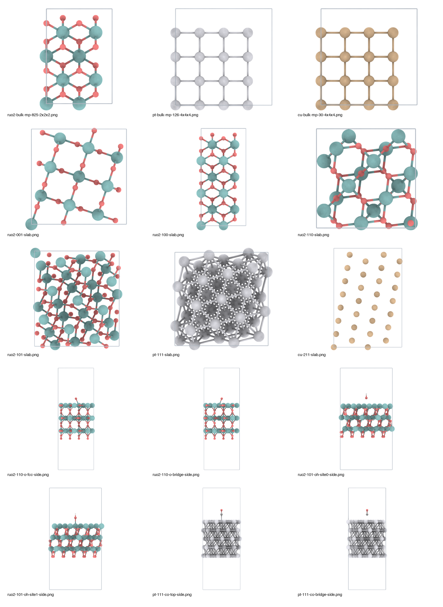

# speck-mcp

MCP server and Codex skill for publication-quality atomistic structure rendering.

The renderer wraps the `modern-speck` WebGL viewer, adds `ase-ts` structure IO, and exposes agent-facing tools for structure summaries, standalone viewer HTML, and deterministic SVG/PNG exports.

## Example Output

These examples were generated from RuO2 slabs, Pt/Cu bulk and slabs, and adsorbate slabs with the current defaults: bond threshold `1.05`, compact atom scale, visible unit cells, bounded 768-sample PNG export, and white background only for this README preview.



## Tools

- `speck_structure_summary`: parse a structure and report formula, atom count, inferred bonds, PBC, and cell status.
- `speck_render_image`: render SVG or PNG with cell-basis camera presets, bonds, unit cell, transparent background, and size controls.
- `speck_viewer_html`: write a standalone interactive viewer with mouse rotation, camera sliders, cell/bond toggles, and export controls.

## Supported Formats

Input parsing is provided by `ase-ts`, including common atomistic formats such as XYZ, extxyz, POSCAR/CONTCAR, CIF, PDB, `vasprun.xml`, ORCA output, and ASE trajectories.

## Development

```bash
npm install
npm run build
npm run build:viewer
npm run test
```

Run the MCP server over stdio:

```bash
node dist/src/server.js
```

Use the CLI renderer directly:

```bash
node dist/src/cli.js render \
  --input examples/water.extxyz \
  --format extxyz \
  --output .tmp/water.png \
  --width 1200 \
  --height 900 \
  --view top \
  --transparent \
  --cell
```

## Rendering Defaults

- Bond inference cutoff: `1.05 * (radiusA + radiusB)`.
- Viewer bond threshold: `1.05`.
- Default viewer atom scale: `0.5`.
- PNG export uses transparent background when requested.
- Export mode accumulates 768 samples for smooth AO/depth, then exits instead of running the interactive viewer loop continuously.
